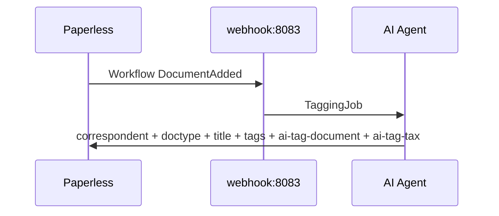

# paperless-ai-tagger

Automatic tagging of [Paperless-ngx](https://github.com/paperless-ngx/paperless-ngx) documents via AI.

When a new document is added in Paperless, a workflow webhook fires this service. The webhook receiver starts an AI agent (selected via `AGENT_PROVIDER`) and automatically classifies and tax-checks the document. Paperless access goes through [paperless-ngx-mcp](https://github.com/freeformz/paperless-ngx-mcp) (Cursor/Codex) or the Paperless REST API (OpenRouter).

## Architecture


| Component | Role |
|---|---|
| **Paperless-ngx** | Document management; fires webhook on “Document Added” |
| **webhook-receiver** | FastAPI service: accepts webhook, starts the selected agent |
| **paperless-ngx-mcp** | MCP server (stdio) for Cursor/Codex; included in the image |
| **prompts/03-tag-document-tax.md** | MCP prompt for Cursor/Codex: classification + tax in one run |
| **prompts/openrouter/** | JSON prompt for the OpenRouter single-shot orchestrator |

## Pipeline (Stage 03)

A webhook on port `8083` runs classification and tax review in a single pass.



The service responds asynchronously with `202` and processes jobs in a bounded queue (`MAX_CONCURRENT_JOBS`).

## Prerequisites

- Docker and Docker Compose on a headless server
- Running Paperless-ngx instance with API token
- API key for the selected provider (see [Agent Providers](#agent-providers))
- Paperless: `PAPERLESS_URL` set (for `{{doc_url}}` in the webhook)

## Quick Start

### 1. Clone the repository and configure

```bash
git clone https://github.com/boexler/paperless-ai-tagger.git
cd paperless-ai-tagger
cp .env.example .env
```

Adjust `.env` (shared base):

```env
PAPERLESS_BASE_URL=https://paperless.your-domain.com
PAPERLESS_API_TOKEN=your-api-token
WEBHOOK_SECRET=a-long-random-secret
AGENT_PROVIDER=cursor
```

Provider-specific keys and models: see subsections under [Agent Providers](#agent-providers).

> **Image version:** The `paperless-ngx-mcp` binary is pulled from [freeformz/paperless-ngx-mcp](https://github.com/freeformz/paperless-ngx-mcp) at image build time. Adjust the version in `services/webhook-receiver/Dockerfile`.

### 2. Start the stack

```bash
docker compose up -d --build
```

| Instance | Container | Port | Prompt (Cursor/Codex) |
|---|---|---|---|
| Combined classification + tax | `paperless-ai-tagger-03-tag-document-tax.md` | `8083` (`WEBHOOK_PORT_03`) | `03-tag-document-tax.md` |

Health check:

```bash
curl http://localhost:8083/health
```

### 3. Set up the Paperless workflow

In Paperless under **Settings → Workflows**, create a workflow:

| Field | Value |
|---|---|
| Trigger | Document Added |
| Action | Webhook |
| URL | `http://<your-server>:8083/webhook?secret=<WEBHOOK_SECRET>` |
| Body | JSON (see below) |
| Send as JSON | enable |

Webhook body:

```json
{
  "doc_url": "{{doc_url}}",
  "doc_title": "{{doc_title}}",
  "correspondent": "{{correspondent}}",
  "document_type": "{{document_type}}"
}
```

> Paperless has no direct `{{document_id}}` placeholder. The document ID is extracted from `{{doc_url}}` (e.g. `.../documents/87/` → ID `87`).

Optional: set filters so already tagged documents (`ai-tag-document` / `ai-tag-tax`) are not triggered again.

### 4. Test

Synchronous test endpoint (for debugging; blocks until the agent finishes):

```bash
curl -X POST "http://localhost:8083/webhook/sync?secret=YOUR_SECRET" \
  -H "Content-Type: application/json" \
  -d '{
    "doc_url": "https://paperless.example.com/documents/42/",
    "doc_title": "Test Invoice",
    "correspondent": "Acme GmbH",
    "document_type": "Invoice"
  }'
```

Or the smoke-test script:

```bash
WEBHOOK_SECRET=your-secret ./scripts/smoke-test.sh
```

## Project Structure

```
paperless-ai-tagger/
├── docker-compose.yml
├── .env.example
├── prompts/
│   ├── 03-tag-document-tax.md      # MCP prompt (Cursor/Codex)
│   └── openrouter/                 # Single-shot prompt (OpenRouter)
│       └── 03-tag-document-tax.md
├── services/
│   └── webhook-receiver/
│       ├── Dockerfile
│       ├── requirements.txt
│       └── app/
│           ├── main.py
│           ├── job_queue.py
│           ├── tagger.py
│           ├── paperless_client.py # REST client (OpenRouter)
│           ├── providers/          # cursor / codex / openrouter
│           ├── config.py
│           ├── models.py
│           └── dedup.py
└── scripts/
    └── smoke-test.sh
```

## Agent Providers

Switchable via `AGENT_PROVIDER`. Do **not** point multiple providers at the same Paperless workflow in parallel.

| Provider | Value | Integration |
|---|---|---|
| **Cursor** (default) | `cursor` | [Cursor Python SDK](https://cursor.com/docs/sdk/python) + MCP |
| **Codex** | `codex` | [OpenAI Codex CLI](https://developers.openai.com/codex/) + MCP |
| **OpenRouter** | `openrouter` | OpenRouter API (single-shot JSON) + Paperless REST |

### cursor

Uses the Cursor Python SDK with inline `paperless-ngx-mcp`. Prompt: `prompts/03-tag-document-tax.md`.

```env
AGENT_PROVIDER=cursor
CURSOR_API_KEY=cursor_your_api_key
CURSOR_MODEL=composer-2.5
CURSOR_MODEL_PARAMS=fast:false
```

| Variable | Required | Description |
|---|---|---|
| `CURSOR_API_KEY` | yes | [Cursor API Key](https://cursor.com/dashboard/integrations) |
| `CURSOR_MODEL` | no | Model ID (default: `composer-2.5`) |
| `CURSOR_MODEL_PARAMS` | no | Parameters as `key:value,key:value` (default: `fast:false`) |
| `CURSOR_LIST_MODELS_ON_STARTUP` | no | Log models on startup (default: `false`) |

### codex

Runs `codex exec` non-interactively. On startup, `$CODEX_HOME/config.toml` is created with Paperless MCP. Prompt: `prompts/03-tag-document-tax.md`.

```env
AGENT_PROVIDER=codex
CODEX_API_KEY=sk-your-openai-key
CODEX_MODEL=gpt-5.4-mini
CODEX_REASONING_EFFORT=low
CODEX_MODEL_VERBOSITY=low
CODEX_NETWORK_ACCESS=true
```

`CODEX_NETWORK_ACCESS=true` is required so Codex can reach the Paperless API via MCP.

| Variable | Required | Description |
|---|---|---|
| `CODEX_API_KEY` | yes | OpenAI API key for Codex CLI |
| `CODEX_MODEL` | no | Model (default: `gpt-5.4-mini`) |
| `CODEX_REASONING_EFFORT` | no | `none`/`minimal`/`low`/`medium`/`high`/`xhigh` (default: `low`) |
| `CODEX_MODEL_VERBOSITY` | no | `low`/`medium`/`high` (default: `low`) |
| `CODEX_APPROVAL_POLICY` | no | Default: `never` |
| `CODEX_SANDBOX` | no | Default: `workspace-write` |
| `CODEX_NETWORK_ACCESS` | no | Default: `true` |
| `CODEX_COMMAND` | no | CLI path (default: `codex`) |
| `CODEX_HOME` | no | Config directory (default: `/data/codex`) |

### openrouter

No tool calling. Python loads context via the Paperless REST API, makes **one** OpenRouter request (classification + tags + tax in a single JSON), and writes results back deterministically.

Prompt: `prompts/openrouter/03-tag-document-tax.md` (JSON-only).

```env
AGENT_PROVIDER=openrouter
OPENROUTER_API_KEY=sk-or-v1-your-key
OPENROUTER_MODEL=nvidia/nemotron-3-ultra-550b-a55b:free
```

| Variable | Required | Description |
|---|---|---|
| `OPENROUTER_API_KEY` | yes | [OpenRouter API Key](https://openrouter.ai/keys) |
| `OPENROUTER_MODEL` | no | Model slug (default: `nvidia/nemotron-3-ultra-550b-a55b:free`) |
| `OPENROUTER_BASE_URL` | no | API URL (default: `https://openrouter.ai/api/v1`) |
| `OPENROUTER_HTTP_REFERER` | no | Ranking header (default: `https://github.com/boexler/paperless-ai-tagger`) |
| `OPENROUTER_APP_NAME` | no | `X-Title` header (default: `paperless-ai-tagger`) |
| `OPENROUTER_MAX_CONTENT_CHARS` | no | Truncate OCR text (default: `1000000`) |
| `OPENROUTER_RETRY_ATTEMPTS` | no | Completion retries on empty/overloaded response (default: `3`) |
| `OPENROUTER_RETRY_BACKOFF_SECONDS` | no | Base for linear backoff in seconds (default: `5` → 5s, 10s, 15s) |

Notes:

- Free models may have rate limits and lower quality.
- When retries are exhausted, the service sets the `ai-error` tag and a note on the document.
- OpenRouter shows the app via `HTTP-Referer` and `X-Title` (defaults: repo URL + `paperless-ai-tagger`).
- The model should reliably produce structured JSON ([OpenRouter Models](https://openrouter.ai/models)).
- Do not run in parallel with Cursor/Codex on the same workflow.

### Local development (without Docker)

```bash
cd services/webhook-receiver
python -m venv .venv
source .venv/bin/activate   # Windows: .venv\Scripts\activate
pip install -r requirements.txt
```

For Cursor/Codex, also install `paperless-ngx-mcp` (Go):

```bash
go install github.com/freeformz/paperless-ngx-mcp@latest
```

```bash
export WEBHOOK_SECRET=test
export AGENT_PROVIDER=cursor
export CURSOR_API_KEY=cursor_...
export PAPERLESS_BASE_URL=http://localhost:8000
export PAPERLESS_API_TOKEN=your-token
export PAPERLESS_MCP_COMMAND=$HOME/go/bin/paperless-ngx-mcp
export PROMPT_TEMPLATE_PATH=../../prompts/03-tag-document-tax.md

# OpenRouter locally:
# export AGENT_PROVIDER=openrouter
# export OPENROUTER_API_KEY=sk-or-v1-...

uvicorn app.main:app --reload --port 8083
```

## Operations

### Job queue

`MAX_CONCURRENT_JOBS` limits parallel tagging jobs (default: `1`). `/health` reports `pending_jobs` and `queued_jobs`.

The queue is in-memory — unprocessed jobs are lost on container restart. Completed jobs remain protected by deduplication.

### Deduplication

Already processed document IDs are skipped for `DEDUP_TTL_HOURS` (default: 24 h). Entries live in `/data/processed_documents.json`.

With `DEDUP_SKIP_CHECK=true`, the skip check is disabled: known documents are tagged again. Successful runs are still written to `processed_documents.json`.

Remove a single document for a re-run (inside the container):

```bash
python -c "import json; from pathlib import Path; p = Path('/data/processed_documents.json'); data = json.loads(p.read_text(encoding='utf-8')); data.pop('1028', None); p.write_text(json.dumps(data), encoding='utf-8'); print('Remaining:', data)"
```

Replace `1028` with the desired document ID. Check first: `cat /data/processed_documents.json`.

Alternatively for tests: `POST /webhook/sync` does not check dedup on start (marks again after a successful run).

### Security

- **Paperless API token** lives in the webhook-receiver container — run only on an internal network.
- Choose a long, random **webhook secret**.
- Use a Paperless API token with minimal permissions (dedicated user).
- Expose `WEBHOOK_PORT_03` externally only if needed; a reverse proxy with TLS is recommended.

### Cost

Each new document triggers one or more model calls. Watch costs and rate limits when uploading many documents.

| Goal | Cursor | Codex | OpenRouter |
|---|---|---|---|
| cheapest | `CURSOR_MODEL_PARAMS=fast:true` | `CODEX_MODEL=gpt-5.4-mini`, `CODEX_REASONING_EFFORT=low` | Free model or `openai/gpt-4o-mini` |
| balanced | `fast:false` | `CODEX_MODEL=gpt-5.4`, effort `medium` | Stronger tool/JSON model |
| maximum quality | `fast:false` | Effort `high` | Frontier model with JSON reliability |

### OCR timing

On “Document Added”, OCR is usually finished. If the agent sees empty content, a retry mechanism can be added.

## Connect Paperless with an existing Docker stack

**Option A – external network:**

```yaml
# In this project's docker-compose.yml:
networks:
  paperless-ai-tagger:
    external: true
    name: your-paperless-network
```

Set `PAPERLESS_BASE_URL` to the internal Paperless URL (e.g. `http://paperless:8000`).

**Option B – webhook via host IP:**

Paperless sends the webhook to `http://<server-ip>:8083/webhook?secret=...`.

## Environment Variables (shared)

| Variable | Required | Description |
|---|---|---|
| `PAPERLESS_BASE_URL` | yes | URL of the Paperless instance (alias: `PAPERLESS_URL`) |
| `PAPERLESS_API_TOKEN` | yes | API token for Paperless (alias: `PAPERLESS_TOKEN`) |
| `AGENT_PROVIDER` | no | `cursor` (default), `codex`, or `openrouter` |
| `WEBHOOK_SECRET` | yes | Secret for webhook authentication |
| `WEBHOOK_PORT_03` | no | Host port (default: `8083`) |
| `PROMPT_TEMPLATE` | no | MCP prompt under `prompts/` (default: `03-tag-document-tax.md`) |
| `PROMPT_TEMPLATE_PATH` | no | Full path to MCP prompt (overrides `PROMPT_TEMPLATE`) |
| `PAPERLESS_MCP_COMMAND` | no | MCP binary (default: `/usr/local/bin/paperless-ngx-mcp`) |
| `DEDUP_TTL_HOURS` | no | Deduplication window (default: `24`) |
| `DEDUP_SKIP_CHECK` | no | Disable skip check; writes remain active (default: `false`) |
| `MAX_CONCURRENT_JOBS` | no | Parallel jobs (default: `1`) |
| `LOG_LEVEL` | no | Log level (default: `INFO`) |

Provider-specific variables: see [cursor](#cursor), [codex](#codex), [openrouter](#openrouter).

## Troubleshooting

| Problem | Solution |
|---|---|
| `doc_url` empty in webhook | Set `PAPERLESS_URL` in Paperless |
| `401 Invalid webhook secret` | Align secret in URL/header and `.env` |
| Agent does not start | Check provider key (`CURSOR_API_KEY` / `CODEX_API_KEY` / `OPENROUTER_API_KEY`) |
| MCP connection failed | Binary present? `docker compose exec webhook-receiver-03-tag-document-tax paperless-ngx-mcp --version` |
| OpenRouter: invalid JSON / run_error | Switch model; check free-tier rate limits; inspect raw response logs |
| Webhook does not reach service | Docker network / firewall / `PAPERLESS_WEBHOOKS_ALLOW_INTERNAL_REQUESTS` |
| Document tagged twice | Check `DEDUP_TTL_HOURS` and workflow filters |
| `Skipping document … (already processed recently)` | Delete entry in `/data/processed_documents.json` (see [Deduplication](#deduplication)) |
| `pip install` fails during image build | Host needs `linux/amd64` or `linux/arm64`; enough memory for `cursor-sdk` wheel |

Logs:

```bash
docker compose logs -f webhook-receiver-03-tag-document-tax
```

## Breaking Changes (Migration)

| Old | New |
|---|---|
| Two-stage pipeline 01→02 (ports 8081/8082) | Stage 03 only on port `8083` |
| `prompts/01-tag-document.md`, `prompts/02-tag-tax.md` | removed; combined prompt `03-tag-document-tax.md` |
| Services `webhook-receiver-01-*` / `02-*` | only `webhook-receiver-03-tag-document-tax` |
| `WEBHOOK_PORT_01` / `WEBHOOK_PORT_02` | removed; `WEBHOOK_PORT_03` |
| Cursor/Codex only | additionally `AGENT_PROVIDER=openrouter` |

Point the Paperless webhook URL to port `8083`, stop old 01/02 containers, then `docker compose up -d --build`.

## License

MIT

## Acknowledgments

- [Paperless-ngx](https://github.com/paperless-ngx/paperless-ngx)
- [paperless-ngx-mcp](https://github.com/freeformz/paperless-ngx-mcp) by freeformz
- [Cursor SDK](https://cursor.com/docs/sdk/python)
- [OpenAI Codex](https://developers.openai.com/codex/)
- [OpenRouter](https://openrouter.ai/)
