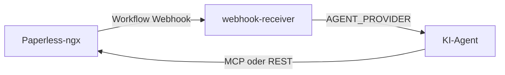

# paperless-ai-tagger

Automatisches Taggen von [Paperless-ngx](https://github.com/paperless-ngx/paperless-ngx)-Dokumenten per KI.

Wenn in Paperless ein neues Dokument hinzukommt, feuert ein Workflow-Webhook diesen Dienst. Der Webhook-Receiver startet einen KI-Agenten (gewählt über `AGENT_PROVIDER`) und lässt das Dokument automatisch klassifizieren und steuerlich prüfen. Paperless-Zugriff erfolgt über [paperless-ngx-mcp](https://github.com/freeformz/paperless-ngx-mcp) (Cursor/Codex) bzw. die Paperless REST-API (OpenRouter).

## Architektur



| Komponente | Rolle |
|---|---|
| **Paperless-ngx** | Dokumentenverwaltung, feuert Webhook bei „Document Added“ |
| **webhook-receiver** | FastAPI-Dienst: nimmt Webhook entgegen, startet den gewählten Agenten |
| **paperless-ngx-mcp** | MCP-Server (stdio) für Cursor/Codex; im Image enthalten |
| **prompts/03-tag-document-tax.md** | MCP-Prompt für Cursor/Codex: Klassifikation + Steuer in einem Lauf |
| **prompts/openrouter/** | JSON-Prompt für den OpenRouter Single-Shot-Orchestrator |

## Pipeline (Stufe 03)

Ein Webhook auf Port `8083` führt Klassifikation und Steuerprüfung in einem Durchlauf aus.


Der Dienst antwortet asynchron mit `202` und verarbeitet Jobs in einer begrenzten Warteschlange (`MAX_CONCURRENT_JOBS`).

## Voraussetzungen

- Docker und Docker Compose auf einem Headless-Server
- Laufende Paperless-ngx-Instanz mit API-Token
- API-Key für den gewählten Provider (siehe [Agent-Provider](#agent-provider))
- Paperless: `PAPERLESS_URL` gesetzt (für `{{doc_url}}` im Webhook)

## Schnellstart

### 1. Repository klonen und konfigurieren

```bash
git clone https://github.com/boexler/paperless-ai-tagger.git
cd paperless-ai-tagger
cp .env.example .env
```

`.env` anpassen (gemeinsame Basis):

```env
PAPERLESS_BASE_URL=https://paperless.deine-domain.de
PAPERLESS_API_TOKEN=dein-api-token
WEBHOOK_SECRET=ein-langes-zufaelliges-secret
AGENT_PROVIDER=cursor
```

Provider-spezifische Keys und Modelle: siehe Unterkapitel unter [Agent-Provider](#agent-provider).

> **Image-Version:** Das `paperless-ngx-mcp`-Binary wird beim Image-Build aus [freeformz/paperless-ngx-mcp](https://github.com/freeformz/paperless-ngx-mcp) übernommen. Version in `services/webhook-receiver/Dockerfile` anpassen.

### 2. Stack starten

OpenRouter-App-Name im Image enthält den Short-Commit (Build-Arg `GIT_SHA`):

```bash
GIT_SHA=$(git rev-parse --short HEAD) docker compose up -d --build
```

Windows (PowerShell):

```powershell
$env:GIT_SHA = (git rev-parse --short HEAD); docker compose up -d --build
```

Ohne `GIT_SHA` wird `unknown` eingebettet (`paperless-ai-tagger@unknown`).

| Instanz | Container | Port | Prompt (Cursor/Codex) |
|---|---|---|---|
| Kombi Klassifikation + Steuer | `paperless-ai-tagger-03-tag-document-tax.md` | `8083` (`WEBHOOK_PORT_03`) | `03-tag-document-tax.md` |

Healthcheck:

```bash
curl http://localhost:8083/health
```

### 3. Paperless-Workflow einrichten

In Paperless unter **Einstellungen → Workflows** einen Workflow anlegen:

| Feld | Wert |
|---|---|
| Trigger | Document Added |
| Action | Webhook |
| URL | `http://<dein-server>:8083/webhook?secret=<WEBHOOK_SECRET>` |
| Body | JSON (siehe unten) |
| Send as JSON | aktivieren |

Webhook-Body:

```json
{
  "doc_url": "{{doc_url}}",
  "doc_title": "{{doc_title}}",
  "correspondent": "{{correspondent}}",
  "document_type": "{{document_type}}"
}
```

> Paperless hat keinen direkten `{{document_id}}`-Placeholder. Die Dokumenten-ID wird aus `{{doc_url}}` extrahiert (z. B. `.../documents/87/` → ID `87`).

Optional: Filter so setzen, dass bereits getaggte Dokumente (`ai-tag-document` / `ai-tag-tax`) nicht erneut getriggert werden.

### 4. Testen

Synchroner Test-Endpunkt (für Debugging, blockiert bis der Agent fertig ist):

```bash
curl -X POST "http://localhost:8083/webhook/sync?secret=DEIN_SECRET" \
  -H "Content-Type: application/json" \
  -d '{
    "doc_url": "https://paperless.example.com/documents/42/",
    "doc_title": "Test Rechnung",
    "correspondent": "Acme GmbH",
    "document_type": "Rechnung"
  }'
```

Oder das Smoke-Test-Skript:

```bash
WEBHOOK_SECRET=dein-secret ./scripts/smoke-test.sh
```

## Projektstruktur

```
paperless-ai-tagger/
├── docker-compose.yml
├── .env.example
├── prompts/
│   ├── 03-tag-document-tax.md      # MCP-Prompt (Cursor/Codex)
│   └── openrouter/                 # Single-Shot-Prompt (OpenRouter)
│       └── 03-tag-document-tax.md
├── services/
│   └── webhook-receiver/
│       ├── Dockerfile
│       ├── requirements.txt
│       └── app/
│           ├── main.py
│           ├── job_queue.py
│           ├── tagger.py
│           ├── paperless_client.py # REST-Client (OpenRouter)
│           ├── providers/          # cursor / codex / openrouter
│           ├── config.py
│           ├── models.py
│           └── dedup.py
└── scripts/
    └── smoke-test.sh
```

## Agent-Provider

Umschaltbar per `AGENT_PROVIDER`. **Nicht** mehrere Provider parallel auf denselben Paperless-Workflow legen.

| Provider | Wert | Integration |
|---|---|---|
| **Cursor** (Standard) | `cursor` | [Cursor Python SDK](https://cursor.com/docs/sdk/python) + MCP |
| **Codex** | `codex` | [OpenAI Codex CLI](https://developers.openai.com/codex/) + MCP |
| **OpenRouter** | `openrouter` | OpenRouter API (Single-Shot JSON) + Paperless REST |

### cursor

Nutzt das Cursor Python SDK mit inline `paperless-ngx-mcp`. Prompt: `prompts/03-tag-document-tax.md`.

```env
AGENT_PROVIDER=cursor
CURSOR_API_KEY=cursor_dein_api_key
CURSOR_MODEL=composer-2.5
CURSOR_MODEL_PARAMS=fast:false
```

| Variable | Pflicht | Beschreibung |
|---|---|---|
| `CURSOR_API_KEY` | ja | [Cursor API Key](https://cursor.com/dashboard/integrations) |
| `CURSOR_MODEL` | nein | Modell-ID (Standard: `composer-2.5`) |
| `CURSOR_MODEL_PARAMS` | nein | Parameter als `key:value,key:value` (Standard: `fast:false`) |
| `CURSOR_LIST_MODELS_ON_STARTUP` | nein | Modelle beim Start loggen (Standard: `false`) |

### codex

Startet `codex exec` non-interactive. Beim Start wird `$CODEX_HOME/config.toml` mit Paperless-MCP erzeugt. Prompt: `prompts/03-tag-document-tax.md`.

```env
AGENT_PROVIDER=codex
CODEX_API_KEY=sk-dein-openai-key
CODEX_MODEL=gpt-5.4-mini
CODEX_REASONING_EFFORT=low
CODEX_MODEL_VERBOSITY=low
CODEX_NETWORK_ACCESS=true
```

`CODEX_NETWORK_ACCESS=true` ist nötig, damit Codex die Paperless-API über MCP erreichen kann.

| Variable | Pflicht | Beschreibung |
|---|---|---|
| `CODEX_API_KEY` | ja | OpenAI API Key für Codex CLI |
| `CODEX_MODEL` | nein | Modell (Standard: `gpt-5.4-mini`) |
| `CODEX_REASONING_EFFORT` | nein | `none`/`minimal`/`low`/`medium`/`high`/`xhigh` (Standard: `low`) |
| `CODEX_MODEL_VERBOSITY` | nein | `low`/`medium`/`high` (Standard: `low`) |
| `CODEX_APPROVAL_POLICY` | nein | Standard: `never` |
| `CODEX_SANDBOX` | nein | Standard: `workspace-write` |
| `CODEX_NETWORK_ACCESS` | nein | Standard: `true` |
| `CODEX_COMMAND` | nein | CLI-Pfad (Standard: `codex`) |
| `CODEX_HOME` | nein | Config-Verzeichnis (Standard: `/data/codex`) |

### openrouter

Kein Tool-Calling. Python lädt Kontext über die Paperless REST-API, stellt **eine** OpenRouter-Anfrage (Klassifikation + Tags + Steuer in einem JSON), schreibt Ergebnisse deterministisch zurück.

Prompt: `prompts/openrouter/03-tag-document-tax.md` (JSON-only).

```env
AGENT_PROVIDER=openrouter
OPENROUTER_API_KEY=sk-or-v1-dein-key
OPENROUTER_MODEL=nvidia/nemotron-3-ultra-550b-a55b:free
```

| Variable | Pflicht | Beschreibung |
|---|---|---|
| `OPENROUTER_API_KEY` | ja | [OpenRouter API Key](https://openrouter.ai/keys) |
| `OPENROUTER_MODEL` | nein | Modell-Slug (Standard: `nvidia/nemotron-3-ultra-550b-a55b:free`) |
| `OPENROUTER_BASE_URL` | nein | API-URL (Standard: `https://openrouter.ai/api/v1`) |
| `OPENROUTER_HTTP_REFERER` | nein | Optionaler Ranking-Header |
| `OPENROUTER_APP_NAME` | nein | Optionaler `X-Title`-Override (Standard: `paperless-ai-tagger@<GIT_SHA>`) |
| `OPENROUTER_MAX_CONTENT_CHARS` | nein | OCR-Text kürzen (Standard: `1000000`) |
| `OPENROUTER_RETRY_ATTEMPTS` | nein | Completion-Versuche bei leerer/überlasteter Antwort (Standard: `3`) |
| `OPENROUTER_RETRY_BACKOFF_SECONDS` | nein | Basis für lineares Backoff in Sekunden (Standard: `5` → 5s, 10s, 15s) |
| `GIT_SHA` | nein | Short-Commit als Docker-Build-Arg (Standard: `unknown`) |

Hinweise:

- Free-Modelle können Rate Limits und schwächere Qualität haben.
- Bei ausgeschöpften Retries setzt der Dienst das Tag `ai-error` und eine Notiz am Dokument.
- OpenRouter zeigt den App-Namen aus dem `X-Title`-Header (Standard inkl. Build-`GIT_SHA`).
- Modell sollte zuverlässig strukturiertes JSON liefern ([OpenRouter Models](https://openrouter.ai/models)).
- Nicht parallel mit Cursor/Codex auf denselben Workflow betreiben.

### Lokale Entwicklung (ohne Docker)

```bash
cd services/webhook-receiver
python -m venv .venv
source .venv/bin/activate   # Windows: .venv\Scripts\activate
pip install -r requirements.txt
```

Für Cursor/Codex zusätzlich `paperless-ngx-mcp` installieren (Go):

```bash
go install github.com/freeformz/paperless-ngx-mcp@latest
```

```bash
export WEBHOOK_SECRET=test
export AGENT_PROVIDER=cursor
export CURSOR_API_KEY=cursor_...
export PAPERLESS_BASE_URL=http://localhost:8000
export PAPERLESS_API_TOKEN=dein-token
export PAPERLESS_MCP_COMMAND=$HOME/go/bin/paperless-ngx-mcp
export PROMPT_TEMPLATE_PATH=../../prompts/03-tag-document-tax.md

# OpenRouter lokal:
# export AGENT_PROVIDER=openrouter
# export OPENROUTER_API_KEY=sk-or-v1-...

uvicorn app.main:app --reload --port 8083
```

## Betrieb

### Job-Warteschlange

`MAX_CONCURRENT_JOBS` begrenzt parallele Tagging-Jobs (Standard: `1`). `/health` zeigt `pending_jobs` und `queued_jobs`.

Die Queue liegt im Arbeitsspeicher — bei Container-Neustart gehen noch nicht verarbeitete Jobs verloren. Abgeschlossene Jobs bleiben über Dedup geschützt.

### Deduplizierung

Bereits verarbeitete Dokument-IDs werden für `DEDUP_TTL_HOURS` (Standard: 24 h) übersprungen. Einträge liegen in `/data/processed_documents.json`.

Mit `DEDUP_SKIP_CHECK=true` wird die Skip-Prüfung deaktiviert: bereits bekannte Dokumente werden erneut getaggt. Erfolgreiche Läufe werden weiterhin in `processed_documents.json` geschrieben.

Einzelnes Dokument für einen erneuten Lauf entfernen (im Container):

```bash
python -c "import json; from pathlib import Path; p = Path('/data/processed_documents.json'); data = json.loads(p.read_text(encoding='utf-8')); data.pop('1028', None); p.write_text(json.dumps(data), encoding='utf-8'); print('Remaining:', data)"
```

`1028` durch die gewünschte Dokument-ID ersetzen. Vorher prüfen: `cat /data/processed_documents.json`.

Alternativ für Tests: `POST /webhook/sync` prüft Dedup nicht beim Start (markiert nach erfolgreichem Lauf erneut).

### Sicherheit

- **Paperless-API-Token** liegt im webhook-receiver-Container — nur im internen Netz betreiben.
- **Webhook-Secret** lang und zufällig wählen.
- Paperless-API-Token mit minimalen Rechten (eigener User).
- `WEBHOOK_PORT_03` nur nach Bedarf nach außen exposen; Reverse Proxy mit TLS empfohlen.

### Kosten

Jedes neue Dokument löst einen oder mehrere Modell-Aufrufe aus. Bei vielen Uploads Kosten und Rate Limits beachten.

| Ziel | Cursor | Codex | OpenRouter |
|---|---|---|---|
| möglichst günstig | `CURSOR_MODEL_PARAMS=fast:true` | `CODEX_MODEL=gpt-5.4-mini`, `CODEX_REASONING_EFFORT=low` | Free-Modell oder `openai/gpt-4o-mini` |
| ausgewogen | `fast:false` | `CODEX_MODEL=gpt-5.4`, Effort `medium` | stärkeres Tool-/JSON-Modell |
| maximale Qualität | `fast:false` | Effort `high` | Frontier-Modell mit JSON-Zuverlässigkeit |

### OCR-Timing

Bei „Document Added“ ist OCR in der Regel fertig. Falls der Agent leeren Content sieht, kann ein Retry-Mechanismus ergänzt werden.

## Paperless mit bestehendem Docker-Stack verbinden

**Option A – externes Netzwerk:**

```yaml
# In docker-compose.yml dieses Projekts:
networks:
  paperless-ai-tagger:
    external: true
    name: dein-paperless-netzwerk
```

`PAPERLESS_BASE_URL` auf die interne Paperless-URL setzen (z. B. `http://paperless:8000`).

**Option B – Webhook über Host-IP:**

Paperless sendet Webhook an `http://<server-ip>:8083/webhook?secret=...`.

## Umgebungsvariablen (gemeinsam)

| Variable | Pflicht | Beschreibung |
|---|---|---|
| `PAPERLESS_BASE_URL` | ja | URL der Paperless-Instanz (Alias: `PAPERLESS_URL`) |
| `PAPERLESS_API_TOKEN` | ja | API-Token für Paperless (Alias: `PAPERLESS_TOKEN`) |
| `AGENT_PROVIDER` | nein | `cursor` (Standard), `codex` oder `openrouter` |
| `WEBHOOK_SECRET` | ja | Secret für Webhook-Authentifizierung |
| `WEBHOOK_PORT_03` | nein | Host-Port (Standard: `8083`) |
| `PROMPT_TEMPLATE` | nein | MCP-Prompt unter `prompts/` (Standard: `03-tag-document-tax.md`) |
| `PROMPT_TEMPLATE_PATH` | nein | Voller Pfad zum MCP-Prompt (überschreibt `PROMPT_TEMPLATE`) |
| `PAPERLESS_MCP_COMMAND` | nein | MCP-Binary (Standard: `/usr/local/bin/paperless-ngx-mcp`) |
| `DEDUP_TTL_HOURS` | nein | Deduplizierungs-Fenster (Standard: `24`) |
| `DEDUP_SKIP_CHECK` | nein | Skip-Prüfung deaktivieren, Schreiben bleibt aktiv (Standard: `false`) |
| `MAX_CONCURRENT_JOBS` | nein | Parallele Jobs (Standard: `1`) |
| `LOG_LEVEL` | nein | Log-Level (Standard: `INFO`) |

Provider-spezifische Variablen: siehe [cursor](#cursor), [codex](#codex), [openrouter](#openrouter).

## Troubleshooting

| Problem | Lösung |
|---|---|
| `doc_url` leer im Webhook | `PAPERLESS_URL` in Paperless setzen |
| `401 Invalid webhook secret` | Secret in URL/Header und `.env` abgleichen |
| Agent startet nicht | Provider-Key prüfen (`CURSOR_API_KEY` / `CODEX_API_KEY` / `OPENROUTER_API_KEY`) |
| MCP-Verbindung fehlgeschlagen | Binary vorhanden? `docker compose exec webhook-receiver-03-tag-document-tax paperless-ngx-mcp --version` |
| OpenRouter: invalid JSON / run_error | Modell wechseln; Free-Tier Rate Limits prüfen; Raw-Response-Logs ansehen |
| Webhook erreicht Dienst nicht | Docker-Netzwerk / Firewall / `PAPERLESS_WEBHOOKS_ALLOW_INTERNAL_REQUESTS` |
| Dokument wird doppelt getaggt | `DEDUP_TTL_HOURS` und Workflow-Filter prüfen |
| `Skipping document … (already processed recently)` | Eintrag in `/data/processed_documents.json` löschen (siehe [Deduplizierung](#deduplizierung)) |
| `pip install` schlägt beim Image-Build fehl | Host braucht `linux/amd64` oder `linux/arm64`; genug Speicher für `cursor-sdk`-Wheel |

Logs:

```bash
docker compose logs -f webhook-receiver-03-tag-document-tax
```

## Breaking Changes (Migration)

| Alt | Neu |
|---|---|
| Zwei-Stufen-Pipeline 01→02 (Ports 8081/8082) | Nur Stufe 03 auf Port `8083` |
| `prompts/01-tag-document.md`, `prompts/02-tag-tax.md` | entfernt; Kombi-Prompt `03-tag-document-tax.md` |
| Services `webhook-receiver-01-*` / `02-*` | nur `webhook-receiver-03-tag-document-tax` |
| `WEBHOOK_PORT_01` / `WEBHOOK_PORT_02` | entfernt; `WEBHOOK_PORT_03` |
| Nur Cursor/Codex | zusätzlich `AGENT_PROVIDER=openrouter` |

Paperless-Webhook-URL auf Port `8083` umstellen, alte 01/02-Container stoppen, dann `docker compose up -d --build`.

## Lizenz

MIT

## Danksagungen

- [Paperless-ngx](https://github.com/paperless-ngx/paperless-ngx)
- [paperless-ngx-mcp](https://github.com/freeformz/paperless-ngx-mcp) von freeformz
- [Cursor SDK](https://cursor.com/docs/sdk/python)
- [OpenAI Codex](https://developers.openai.com/codex/)
- [OpenRouter](https://openrouter.ai/)
