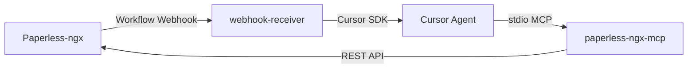

# paperless-ai-tagger

Automatisches Taggen von [Paperless-ngx](https://github.com/paperless-ngx/paperless-ngx)-Dokumenten per KI.

Wenn in Paperless ein neues Dokument hinzukommt, feuert ein Workflow-Webhook diesen Dienst. Der Webhook-Receiver startet einen Cursor-Agenten über das **Cursor SDK** mit [paperless-ngx-mcp](https://github.com/freeformz/paperless-ngx-mcp) und lässt das Dokument automatisch taggen.

## Architektur



| Komponente | Rolle |
|---|---|
| **Paperless-ngx** | Dokumentenverwaltung, feuert Webhook bei „Document Added“ |
| **paperless-ngx-mcp** | MCP-Server (stdio) mit Zugriff auf die Paperless-API, im webhook-receiver-Image enthalten |
| **webhook-receiver** | FastAPI-Dienst, nimmt Webhook entgegen, startet Cursor SDK |
| **prompts/tag-document.md** | Fest definierter Prompt für das Tagging |

## Voraussetzungen

- Docker und Docker Compose auf einem Headless-Server
- Laufende Paperless-ngx-Instanz mit API-Token
- [Cursor API Key](https://cursor.com/dashboard/integrations) (`CURSOR_API_KEY`)
- Paperless: `PAPERLESS_URL` gesetzt (für `{{doc_url}}` im Webhook)

## Schnellstart

### 1. Repository klonen und konfigurieren

```bash
git clone https://github.com/boexler/paperless-ai-tagger.git
cd paperless-ai-tagger
cp .env.example .env
```

`.env` anpassen:

```env
PAPERLESS_BASE_URL=https://paperless.deine-domain.de
PAPERLESS_API_TOKEN=dein-api-token
CURSOR_API_KEY=cursor_dein_api_key
WEBHOOK_SECRET=ein-langes-zufaelliges-secret
```

> **Image-Version:** Das `paperless-ngx-mcp`-Binary wird beim Image-Build aus [freeformz/paperless-ngx-mcp](https://github.com/freeformz/paperless-ngx-mcp) übernommen. Version in `services/webhook-receiver/Dockerfile` anpassen.

### 2. Stack starten

```bash
docker compose up -d --build
```

Der Webhook-Receiver läuft auf Port `8080` (konfigurierbar über `WEBHOOK_PORT`).

Healthcheck:

```bash
curl http://localhost:8080/health
```

### 3. Paperless-Workflow einrichten

In Paperless: **Einstellungen → Workflows → Neuer Workflow**

| Einstellung | Wert |
|---|---|
| Trigger | **Document Added** |
| Filter | optional, z. B. „hat nicht Tag `ai-tagged`“ |
| Aktion | **Webhook** |

**Webhook-URL:**

```
http://<dein-server>:8080/webhook?secret=<WEBHOOK_SECRET>
```

Wenn Paperless im selben Docker-Netzwerk läuft, die interne Service-URL verwenden und `PAPERLESS_WEBHOOKS_ALLOW_INTERNAL_REQUESTS=true` setzen.

**Webhook-Body (JSON):**

```json
{
  "doc_url": "{{doc_url}}",
  "doc_title": "{{doc_title}}",
  "correspondent": "{{correspondent}}",
  "document_type": "{{document_type}}"
}
```

Im Workflow die Option **„Send WebHook payload as JSON“** aktivieren.

> Paperless hat keinen direkten `{{document_id}}`-Placeholder. Die Dokumenten-ID wird aus `{{doc_url}}` extrahiert (z. B. `.../documents/87/` → ID `87`).

### 4. Testen

Synchroner Test-Endpunkt (für Debugging, blockiert bis der Agent fertig ist):

```bash
curl -X POST "http://localhost:8080/webhook/sync?secret=DEIN_SECRET" \
  -H "Content-Type: application/json" \
  -d '{
    "doc_url": "https://paperless.example.com/documents/42/",
    "doc_title": "Test Rechnung",
    "correspondent": "Acme GmbH",
    "document_type": "Rechnung"
  }'
```

Oder das Smoke-Test-Skript:

```bash
WEBHOOK_SECRET=dein-secret ./scripts/smoke-test.sh
```

## Projektstruktur

```
paperless-ai-tagger/
├── docker-compose.yml          # webhook-receiver (inkl. paperless-ngx-mcp)
├── .env.example
├── prompts/
│   └── tag-document.md         # Prompt-Template (anpassbar)
├── config/
│   └── mcp.json.example        # Referenz (SDK nutzt inline MCP-Config)
├── services/
│   └── webhook-receiver/       # FastAPI + Cursor SDK
│       ├── Dockerfile
│       ├── requirements.txt
│       └── app/
│           ├── main.py         # Webhook-Endpunkte
│           ├── tagger.py       # Cursor SDK Integration
│           ├── config.py       # Umgebungsvariablen
│           ├── models.py       # Payload-Modelle
│           └── dedup.py        # Deduplizierung
└── scripts/
    └── smoke-test.sh
```

## Cursor SDK

Der Dienst nutzt das [Cursor Python SDK](https://cursor.com/docs/sdk/python) (`cursor-sdk`), nicht die CLI. Vorteile:

- Sauberes Error-Handling (`CursorAgentError` vs. `result.status == "error"`)
- Inline MCP-Konfiguration ohne `mcp.json` im Container
- Automatisches Cleanup nach `Agent.prompt()`

Kernlogik in `services/webhook-receiver/app/tagger.py`:

```python
AgentOptions(
    api_key=settings.cursor_api_key,
    model=settings.cursor_model,
    local=LocalAgentOptions(cwd="/app", setting_sources=[]),
    mcp_servers={
        "paperless": StdioMcpServerConfig(
            command="/usr/local/bin/paperless-ngx-mcp",
            args=["mcp"],
            env={
                "PAPERLESS_URL": settings.paperless_url,
                "PAPERLESS_TOKEN": settings.paperless_api_token,
            },
        ),
    },
)
```

`paperless-ngx-mcp` spricht **stdio-MCP** (kein HTTP-Port). Der Cursor-Agent startet den Prozess als Subprozess im webhook-receiver-Container.

### Lokale Entwicklung (ohne Docker)

```bash
cd services/webhook-receiver
python -m venv .venv
source .venv/bin/activate   # Windows: .venv\Scripts\activate
pip install -r requirements.txt
```

`paperless-ngx-mcp` installieren (Go):

```bash
go install github.com/freeformz/paperless-ngx-mcp@latest
```

Umgebungsvariablen:

```bash
export WEBHOOK_SECRET=test
export CURSOR_API_KEY=cursor_...
export PAPERLESS_BASE_URL=http://localhost:8000
export PAPERLESS_API_TOKEN=dein-token
export PAPERLESS_MCP_COMMAND=$HOME/go/bin/paperless-ngx-mcp   # Windows: Pfad anpassen
export PROMPT_TEMPLATE_PATH=../../prompts/tag-document.md

uvicorn app.main:app --reload --port 8080
```

## API-Endpunkte

| Methode | Pfad | Beschreibung |
|---|---|---|
| `GET` | `/health` | Healthcheck |
| `POST` | `/webhook` | Asynchron – antwortet sofort mit `202`, Tagging im Hintergrund |
| `POST` | `/webhook/sync` | Synchron – wartet auf Agent-Ergebnis (nur für Tests) |

**Authentifizierung:** Query-Parameter `?secret=...` oder Header `X-Webhook-Secret`.

## Prompt anpassen

Die Datei `prompts/tag-document.md` wird als Template geladen. Verfügbare Platzhalter:

| Platzhalter | Quelle |
|---|---|
| `{{document_id}}` | Aus `doc_url` extrahiert |
| `{{doc_title}}` | Webhook-Payload |
| `{{correspondent}}` | Webhook-Payload |
| `{{document_type}}` | Webhook-Payload |
| `{{doc_url}}` | Webhook-Payload |

Der Prompt wird beim Image-Build ins Container-Image kopiert. Nach Änderungen am Prompt Image neu bauen:

```bash
docker compose up -d --build webhook-receiver
```

In Portainer: Stack **Pull and redeploy** (mit Rebuild).

## Wichtige Hinweise

### Keine Endlosschleife

- Workflow nur auf **„Document Added“** setzen, **nicht** auf „Document Updated“.
- Der Agent setzt den Tag `ai-tagged` – ein Updated-Webhook würde sonst erneut feuern.

### Deduplizierung

Bereits verarbeitete Dokument-IDs werden für `DEDUP_TTL_HOURS` (Standard: 24 h) übersprungen. Daten liegen im Docker-Volume `webhook-data`.

### Sicherheit

- **Paperless-API-Token** liegt im webhook-receiver-Container (für stdio-MCP) – nur im internen Netz betreiben.
- **Webhook-Secret** lang und zufällig wählen.
- Paperless-API-Token mit minimalen Rechten (eigener User).
- `WEBHOOK_PORT` nur nach Bedarf nach außen exposen; Reverse Proxy mit TLS empfohlen.

### Kosten

Jedes neue Dokument löst einen Cursor-Agent-Lauf aus. Bei vielen Uploads Kosten und Rate Limits beachten.

### OCR-Timing

Bei „Document Added“ ist OCR in der Regel fertig. Falls der Agent leeren Content sieht, kann ein Retry-Mechanismus ergänzt werden.

## Paperless mit bestehendem Docker-Stack verbinden

Wenn Paperless bereits in einem eigenen Compose-Stack läuft, zwei Optionen:

**Option A – externes Netzwerk:**

```yaml
# In docker-compose.yml dieses Projekts:
networks:
  paperless-ai-tagger:
    external: true
    name: dein-paperless-netzwerk
```

`PAPERLESS_BASE_URL` auf die interne Paperless-URL setzen (z. B. `http://paperless:8000`).

**Option B – Webhook über Host-IP:**

Paperless sendet Webhook an `http://<server-ip>:8080/webhook?secret=...`.

## Umgebungsvariablen

| Variable | Pflicht | Beschreibung |
|---|---|---|
| `PAPERLESS_BASE_URL` | ja | URL der Paperless-Instanz (Alias: `PAPERLESS_URL`) |
| `PAPERLESS_API_TOKEN` | ja | API-Token für Paperless (Alias: `PAPERLESS_TOKEN`) |
| `CURSOR_API_KEY` | ja | Cursor API Key |
| `CURSOR_MODEL` | nein | Modell (Standard: `composer-2.5`) |
| `WEBHOOK_SECRET` | ja | Secret für Webhook-Authentifizierung |
| `WEBHOOK_PORT` | nein | Externer Port (Standard: `8080`) |
| `PAPERLESS_MCP_COMMAND` | nein | Pfad zum MCP-Binary (Standard: `/usr/local/bin/paperless-ngx-mcp`) |
| `DEDUP_TTL_HOURS` | nein | Deduplizierungs-Fenster (Standard: `24`) |
| `LOG_LEVEL` | nein | Log-Level (Standard: `INFO`) |

## Troubleshooting

| Problem | Lösung |
|---|---|
| `doc_url` leer im Webhook | `PAPERLESS_URL` in Paperless setzen |
| `401 Invalid webhook secret` | Secret in URL/Header und `.env` abgleichen |
| Agent startet nicht | `CURSOR_API_KEY` prüfen, Logs: `docker compose logs webhook-receiver` |
| MCP-Verbindung fehlgeschlagen | Binary vorhanden? `docker compose exec webhook-receiver paperless-ngx-mcp --version` |
| Webhook erreicht Dienst nicht | Docker-Netzwerk / Firewall / `PAPERLESS_WEBHOOKS_ALLOW_INTERNAL_REQUESTS` |
| Dokument wird doppelt getaggt | `DEDUP_TTL_HOURS` prüfen, nur Added-Trigger verwenden |

Logs ansehen:

```bash
docker compose logs -f webhook-receiver
```

## Lizenz

MIT

## Danksagungen

- [Paperless-ngx](https://github.com/paperless-ngx/paperless-ngx)
- [paperless-ngx-mcp](https://github.com/freeformz/paperless-ngx-mcp) von freeformz
- [Cursor SDK](https://cursor.com/docs/sdk/python)
