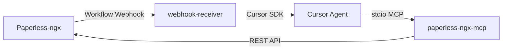
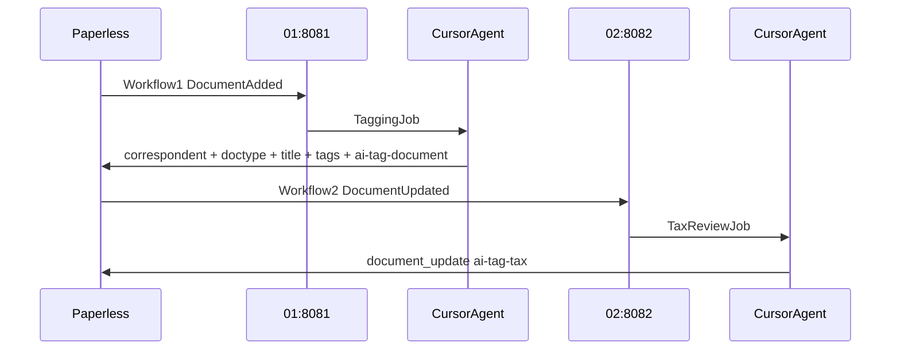

# paperless-ai-tagger

Automatisches Taggen von [Paperless-ngx](https://github.com/paperless-ngx/paperless-ngx)-Dokumenten per KI.

Wenn in Paperless ein neues Dokument hinzukommt, feuert ein Workflow-Webhook diesen Dienst. Der Webhook-Receiver startet einen Cursor-Agenten über das **Cursor SDK** mit [paperless-ngx-mcp](https://github.com/freeformz/paperless-ngx-mcp) und lässt das Dokument automatisch taggen.

## Architektur



| Komponente | Rolle |
|---|---|
| **Paperless-ngx** | Dokumentenverwaltung, feuert Webhook bei „Document Added“ |
| **paperless-ngx-mcp** | MCP-Server (stdio) mit Zugriff auf die Paperless-API, im webhook-receiver-Image enthalten |
| **webhook-receiver** | FastAPI-Dienst, nimmt Webhook entgegen, startet Cursor SDK (zwei Instanzen in der Pipeline) |
| **prompts/01-tag-document.md** | Prompt für Klassifikation: Korrespondent, Dokumenttyp, Titel, Tags (setzt `ai-tag-document`) |
| **prompts/02-tag-tax.md** | Prompt für die nachgelagerte Steuerprüfung (setzt `ai-tag-tax`) |

## Zweistufige Pipeline



Die Reihenfolge steuert Paperless über zwei Workflows — nicht Docker. Stufe 01 antwortet asynchron (`202`); Stufe 02 feuert erst, wenn Paperless das Update mit `ai-tag-document` meldet.

**Port-Konvention:** Stufe `NN` → Host-Port `808N` (01 → 8081, 02 → 8082).

## Voraussetzungen

- Docker und Docker Compose auf einem Headless-Server
- Laufende Paperless-ngx-Instanz mit API-Token
- [Cursor API Key](https://cursor.com/dashboard/integrations) (`CURSOR_API_KEY`)
- Paperless: `PAPERLESS_URL` gesetzt (für `{{doc_url}}` im Webhook)

## Schnellstart

### 1. Repository klonen und konfigurieren

```bash
git clone https://github.com/boexler/paperless-ai-tagger.git
cd paperless-ai-tagger
cp .env.example .env
```

`.env` anpassen:

```env
PAPERLESS_BASE_URL=https://paperless.deine-domain.de
PAPERLESS_API_TOKEN=dein-api-token
CURSOR_API_KEY=cursor_dein_api_key
WEBHOOK_SECRET=ein-langes-zufaelliges-secret
```

> **Image-Version:** Das `paperless-ngx-mcp`-Binary wird beim Image-Build aus [freeformz/paperless-ngx-mcp](https://github.com/freeformz/paperless-ngx-mcp) übernommen. Version in `services/webhook-receiver/Dockerfile` anpassen.

### 2. Stack starten

```bash
docker compose up -d --build
```

Zwei Instanzen starten automatisch:

| Instanz | Container | Port | Prompt |
|---|---|---|---|
| Klassifikation (Stufe 01) | `paperless-ai-tagger-01-tag-document.md` | `8081` (`WEBHOOK_PORT_01`) | `01-tag-document.md` |
| Steuerprüfung (Stufe 02) | `paperless-ai-tagger-02-tag-tax.md` | `8082` (`WEBHOOK_PORT_02`) | `02-tag-tax.md` |

Healthcheck:

```bash
curl http://localhost:8081/health
curl http://localhost:8082/health
```

### 3. Paperless-Workflows einrichten

Die Pipeline besteht aus zwei Workflows. Stufe 02 startet erst, wenn Stufe 01 das Dokument aktualisiert hat (Tag `ai-tag-document` gesetzt).

#### Workflow 1 — Klassifikation (Stufe 01)

In Paperless: **Einstellungen → Workflows → Neuer Workflow**

| Einstellung | Wert |
|---|---|
| Trigger | **Document Added** |
| Filter | optional: Dokument hat **nicht** Tag `ai-tag-document` |
| Aktion | **Webhook** |

**Webhook-URL:**

```
http://<dein-server>:8081/webhook?secret=<WEBHOOK_SECRET>
```

#### Workflow 2 — Steuerprüfung (Stufe 02, nachgelagert)

| Einstellung | Wert |
|---|---|
| Trigger | **Document Updated** |
| Filter | hat Tag `ai-tag-document` **und** hat **nicht** Tag `ai-tag-tax` |
| Aktion | **Webhook** |

**Webhook-URL:**

```
http://<dein-server>:8082/webhook?secret=<WEBHOOK_SECRET>
```

Wenn Paperless im selben Docker-Netzwerk läuft, die interne Service-URL verwenden und `PAPERLESS_WEBHOOKS_ALLOW_INTERNAL_REQUESTS=true` setzen.

**Webhook-Body (JSON):**

```json
{
  "doc_url": "{{doc_url}}",
  "doc_title": "{{doc_title}}",
  "correspondent": "{{correspondent}}",
  "document_type": "{{document_type}}"
}
```

Im Workflow die Option **„Send WebHook payload as JSON“** aktivieren.

> Paperless hat keinen direkten `{{document_id}}`-Placeholder. Die Dokumenten-ID wird aus `{{doc_url}}` extrahiert (z. B. `.../documents/87/` → ID `87`).

### 4. Testen

Synchroner Test-Endpunkt (für Debugging, blockiert bis der Agent fertig ist):

```bash
curl -X POST "http://localhost:8081/webhook/sync?secret=DEIN_SECRET" \
  -H "Content-Type: application/json" \
  -d '{
    "doc_url": "https://paperless.example.com/documents/42/",
    "doc_title": "Test Rechnung",
    "correspondent": "Acme GmbH",
    "document_type": "Rechnung"
  }'
```

Oder das Smoke-Test-Skript:

```bash
WEBHOOK_SECRET=dein-secret ./scripts/smoke-test.sh
```

## Projektstruktur

```
paperless-ai-tagger/
├── docker-compose.yml          # webhook-receiver (inkl. paperless-ngx-mcp)
├── .env.example
├── prompts/
│   ├── 01-tag-document.md        # Prompt: Klassifikation (Korrespondent, Typ, Titel, Tags)
│   └── 02-tag-tax.md             # Prompt: Steuerrelevanz-Prüfung
├── config/
│   └── mcp.json.example        # Referenz (SDK nutzt inline MCP-Config)
├── services/
│   └── webhook-receiver/       # FastAPI + Cursor SDK
│       ├── Dockerfile
│       ├── requirements.txt
│       └── app/
│           ├── main.py         # Webhook-Endpunkte
│           ├── job_queue.py    # Begrenzte Job-Warteschlange
│           ├── tagger.py       # Cursor SDK Integration
│           ├── config.py       # Umgebungsvariablen
│           ├── models.py       # Payload-Modelle
│           └── dedup.py        # Deduplizierung
└── scripts/
    └── smoke-test.sh
```

## Cursor SDK

Der Dienst nutzt das [Cursor Python SDK](https://cursor.com/docs/sdk/python) (`cursor-sdk`), nicht die CLI. Vorteile:

- Sauberes Error-Handling (`CursorAgentError` vs. `result.status == "error"`)
- Inline MCP-Konfiguration ohne `mcp.json` im Container
- Automatisches Cleanup nach `Agent.prompt()`

Kernlogik in `services/webhook-receiver/app/tagger.py`:

```python
AgentOptions(
    api_key=settings.cursor_api_key,
    model=settings.cursor_model,
    local=LocalAgentOptions(cwd="/app", setting_sources=[]),
    mcp_servers={
        "paperless": StdioMcpServerConfig(
            command="/usr/local/bin/paperless-ngx-mcp",
            args=["mcp"],
            env={
                "PAPERLESS_URL": settings.paperless_url,
                "PAPERLESS_TOKEN": settings.paperless_api_token,
            },
        ),
    },
)
```

`paperless-ngx-mcp` spricht **stdio-MCP** (kein HTTP-Port). Der Cursor-Agent startet den Prozess als Subprozess im webhook-receiver-Container.

### Lokale Entwicklung (ohne Docker)

```bash
cd services/webhook-receiver
python -m venv .venv
source .venv/bin/activate   # Windows: .venv\Scripts\activate
pip install -r requirements.txt
```

`paperless-ngx-mcp` installieren (Go):

```bash
go install github.com/freeformz/paperless-ngx-mcp@latest
```

Umgebungsvariablen:

```bash
export WEBHOOK_SECRET=test
export CURSOR_API_KEY=cursor_...
export PAPERLESS_BASE_URL=http://localhost:8000
export PAPERLESS_API_TOKEN=dein-token
export PAPERLESS_MCP_COMMAND=$HOME/go/bin/paperless-ngx-mcp   # Windows: Pfad anpassen
export PROMPT_TEMPLATE_PATH=../../prompts/01-tag-document.md

uvicorn app.main:app --reload --port 8081
```

## API-Endpunkte

| Methode | Pfad | Beschreibung |
|---|---|---|
| `GET` | `/health` | Healthcheck inkl. `pending_jobs` und `queued_jobs` |
| `POST` | `/webhook` | Asynchron – antwortet sofort mit `202`, Tagging im Hintergrund |
| `POST` | `/webhook/sync` | Synchron – wartet auf Agent-Ergebnis (nur für Tests) |

**Authentifizierung:** Query-Parameter `?secret=...` oder Header `X-Webhook-Secret`.

## Prompt anpassen

Jede Instanz lädt ihr Prompt-Template über `PROMPT_TEMPLATE` (Dateiname unter `prompts/`, z. B. `02-tag-tax.md`) oder alternativ über den vollen Pfad `PROMPT_TEMPLATE_PATH` (für lokale Entwicklung).

In Docker wird der Pfad automatisch zu `/app/prompts/<PROMPT_TEMPLATE>` aufgelöst. Container heißen `paperless-ai-tagger-<PROMPT_TEMPLATE>` (z. B. `paperless-ai-tagger-02-tag-tax.md`).

Verfügbare Platzhalter in allen Prompt-Templates:

| Platzhalter | Quelle |
|---|---|
| `{{document_id}}` | Aus `doc_url` extrahiert |
| `{{doc_title}}` | Webhook-Payload |
| `{{correspondent}}` | Webhook-Payload |
| `{{document_type}}` | Webhook-Payload |
| `{{doc_url}}` | Webhook-Payload |

Der Prompt wird beim Image-Build ins Container-Image kopiert. Nach Änderungen am Prompt Image neu bauen:

```bash
docker compose up -d --build
```

In Portainer: Stack **Pull and redeploy** (mit Rebuild).

## Wichtige Hinweise

### Keine Endlosschleife

- **Workflow 1 (Stufe 01)** nur auf **„Document Added“** triggern, nicht auf „Document Updated“.
- **Workflow 2 (Stufe 02)** bewusst auf **„Document Updated“** mit Filter `ai-tag-document`, ohne `ai-tag-tax` — so startet die Steuerprüfung erst nach abgeschlossener Klassifikation.
- Workflow 2 setzt `ai-tag-tax` und löst damit keine erneute Steuerprüfung aus.

### Job-Warteschlange

Eingehende Webhooks werden nicht parallel unbegrenzt gestartet. Jede Instanz verarbeitet Jobs über eine interne Queue mit `MAX_CONCURRENT_JOBS` (Standard: `1` = strikt nacheinander).

- Bulk-Import (z. B. Postfach mit vielen Dokumenten): Paperless feuert viele Webhooks, der Receiver antwortet jeweils mit `202` und arbeitet die Jobs kontrolliert ab.
- Doppelte Webhooks für dieselbe Dokument-ID während ein Job läuft oder wartet: Antwort `skipped` mit `reason: already_queued`.
- `/health` zeigt `pending_jobs` (wartend + laufend) und `queued_jobs` (nur wartend).

Die Queue liegt im Arbeitsspeicher — bei Container-Neustart gehen noch nicht verarbeitete Jobs verloren. Bereits abgeschlossene Jobs bleiben über Dedup geschützt.

### Deduplizierung

Bereits verarbeitete Dokument-IDs werden pro Instanz für `DEDUP_TTL_HOURS` (Standard: 24 h) übersprungen. Jede Instanz hat ein eigenes Volume (`webhook-data-01-tag-document`, `webhook-data-02-tag-tax`), damit Stufe 02 nicht übersprungen wird, weil Stufe 01 dieselbe ID bereits verarbeitet hat.

### Sicherheit

- **Paperless-API-Token** liegt im webhook-receiver-Container (für stdio-MCP) – nur im internen Netz betreiben.
- **Webhook-Secret** lang und zufällig wählen.
- Paperless-API-Token mit minimalen Rechten (eigener User).
- `WEBHOOK_PORT_01` / `WEBHOOK_PORT_02` nur nach Bedarf nach außen exposen; Reverse Proxy mit TLS empfohlen.

### Kosten

Jedes neue Dokument löst einen Cursor-Agent-Lauf aus. Bei vielen Uploads Kosten und Rate Limits beachten.

### OCR-Timing

Bei „Document Added“ ist OCR in der Regel fertig. Falls der Agent leeren Content sieht, kann ein Retry-Mechanismus ergänzt werden.

## Paperless mit bestehendem Docker-Stack verbinden

Wenn Paperless bereits in einem eigenen Compose-Stack läuft, zwei Optionen:

**Option A – externes Netzwerk:**

```yaml
# In docker-compose.yml dieses Projekts:
networks:
  paperless-ai-tagger:
    external: true
    name: dein-paperless-netzwerk
```

`PAPERLESS_BASE_URL` auf die interne Paperless-URL setzen (z. B. `http://paperless:8000`).

**Option B – Webhook über Host-IP:**

Paperless sendet Webhook an `http://<server-ip>:8081/webhook?secret=...`.

## Umgebungsvariablen

| Variable | Pflicht | Beschreibung |
|---|---|---|
| `PAPERLESS_BASE_URL` | ja | URL der Paperless-Instanz (Alias: `PAPERLESS_URL`) |
| `PAPERLESS_API_TOKEN` | ja | API-Token für Paperless (Alias: `PAPERLESS_TOKEN`) |
| `CURSOR_API_KEY` | ja | Cursor API Key |
| `CURSOR_MODEL` | nein | Modell (Standard: `composer-2.5`) |
| `WEBHOOK_SECRET` | ja | Secret für Webhook-Authentifizierung |
| `WEBHOOK_PORT_01` | nein | Port für Klassifikation / Stufe 01 (Standard: `8081`) |
| `WEBHOOK_PORT_02` | nein | Port für Steuerprüfung / Stufe 02 (Standard: `8082`) |
| `PROMPT_TEMPLATE` | nein | Prompt-Dateiname unter `prompts/` (Standard: `01-tag-document.md`) |
| `PROMPT_TEMPLATE_PATH` | nein | Voller Pfad zum Prompt (überschreibt `PROMPT_TEMPLATE`) |
| `PAPERLESS_MCP_COMMAND` | nein | Pfad zum MCP-Binary (Standard: `/usr/local/bin/paperless-ngx-mcp`) |
| `DEDUP_TTL_HOURS` | nein | Deduplizierungs-Fenster (Standard: `24`) |
| `MAX_CONCURRENT_JOBS` | nein | Parallele Tagging-Jobs pro Instanz (Standard: `1`) |
| `LOG_LEVEL` | nein | Log-Level (Standard: `INFO`) |

## Troubleshooting

| Problem | Lösung |
|---|---|
| `doc_url` leer im Webhook | `PAPERLESS_URL` in Paperless setzen |
| `401 Invalid webhook secret` | Secret in URL/Header und `.env` abgleichen |
| Agent startet nicht | `CURSOR_API_KEY` prüfen, Logs: `docker compose logs -f` |
| MCP-Verbindung fehlgeschlagen | Binary vorhanden? `docker compose exec webhook-receiver-01-tag-document paperless-ngx-mcp --version` |
| Webhook erreicht Dienst nicht | Docker-Netzwerk / Firewall / `PAPERLESS_WEBHOOKS_ALLOW_INTERNAL_REQUESTS` |
| Dokument wird doppelt getaggt | `DEDUP_TTL_HOURS` prüfen, Workflow-Filter prüfen |
| Steuerprüfung startet nicht | Workflow 2 auf Port `8082`, Filter `ai-tag-document` ohne `ai-tag-tax` |
| `pip install` schlägt beim Image-Build fehl | Host braucht `linux/amd64` oder `linux/arm64` (kein 32-bit ARM). Genug Speicher/Platz für ~60 MB `cursor-sdk`-Wheel. Build-Log prüfen; bei Proxy `PIP_INDEX_URL` als Build-Arg setzen |

Logs ansehen:

```bash
docker compose logs -f webhook-receiver-01-tag-document
docker compose logs -f webhook-receiver-02-tag-tax
```

## Breaking Changes (Migration)

Bei einem Update von einer älteren Version:

| Alt | Neu |
|---|---|
| `prompts/tag-document.md` | `prompts/01-tag-document.md` |
| `prompts/tag-tax.md` | `prompts/02-tag-tax.md` |
| Port `8080` (Klassifikation) | Port `8081` |
| Port `8081` (Steuer) | Port `8082` |
| `WEBHOOK_PORT_DOCUMENT` / `WEBHOOK_PORT_TAX` | `WEBHOOK_PORT_01` / `WEBHOOK_PORT_02` |
| Service `webhook-receiver-tag-document` | `webhook-receiver-01-tag-document` |
| Service `webhook-receiver-tag-tax` | `webhook-receiver-02-tag-tax` |

Paperless-Webhook-URLs und `.env` entsprechend anpassen, dann `docker compose up -d --build`.

## Lizenz

MIT

## Danksagungen

- [Paperless-ngx](https://github.com/paperless-ngx/paperless-ngx)
- [paperless-ngx-mcp](https://github.com/freeformz/paperless-ngx-mcp) von freeformz
- [Cursor SDK](https://cursor.com/docs/sdk/python)
